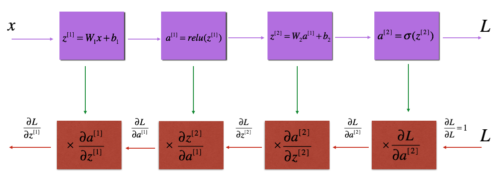

# Overview

Just like HTML is the base language for learning Web Development, the Back Propagation is also the basic Algorithm to learn Deep Learning.
One of the best Intuition for Learning Back-Propagation Algorithm goes as follows:
Imagine that you are in a Examination Hall and the situation is that you have not practiced some concepts that were taught in the class. Luckily you manage to secretly ask the final answer of the question from your friend sitting behind you. Now you know that if you write answer directly then you will not get marks (which you knew from past experiences), so here is the thing what you do now.
So based on the question, you look at the answer and guess what would have been the last step that led to the final answer. Lets say you luckily find out, then you again guess for the previous step until you reach at the end (which is basically the question with the method/operation we applied to get the answer).   

If you can bear it more then here is the oversimplified definition for Back Propagation: If you can go forward then in the same way you can move backward.  
Now here is a pictorial representation of what is being said:

Here you can see the 1st line we move Forward and in the 2nd Line we move Backwards
Here you must be thinking what is happening here and what do these symbols represents? Don’t worry you have already understood the working of Backprop unknowingly, now the rest of things is just Maths.
