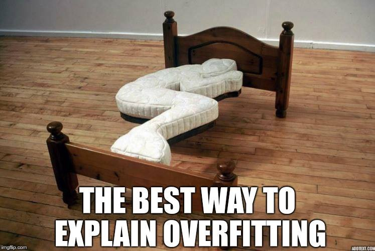
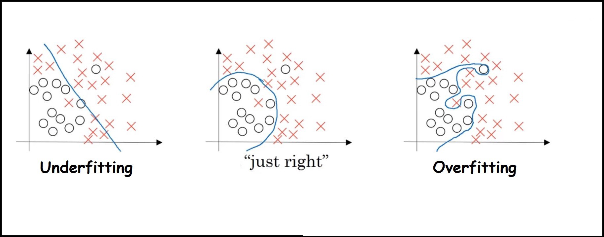

If you are just got started in Machine Learning then you may have heard of these two terms often. And if not then you must😉   

Both the terms have the suffix ‘fitting’ and the interpretation of this word is same as in real life. Like suppose the dress which is not of fitting size can be expressed in two ways i.e. tight or loose.   

In Maths we solve problems by implementing formulas/Algorithms and measures how good it is by accuracy, no. of steps,etc. the same way in Machine Learning we implement models(in fact you will find out later that they are also formulas) and we measures how good it is by accuracy, training time and many other things. And if our model is not doing good then we say it is either Underfitting or Overfitting.   

From above, one thing is clear that both the two are not favorable i.e bad.

Now by reading the below example you will be able to define Overfitting and Underfitting by yourself -    

Suppose you are student and you have exams next weekend. Now there are two conditions which can be bad for you:    

1. Instead of learning the concepts you start cramming/memorizing the answers of all questions. To evaluate yourself, you try to answer the same set of questions and you find yourself able to answer the questions with a high accuracy. Now in the Exam you find that, lot of questions that you have not memorized which is what actually happens every time 😆. This impacts your ability to answer correctly, resulting in a low accuracy.
>This phenomenon is termed to be Overfitting    

   
    
>Simple right? When you get High Accuracy on Training Set and Low Accuracy on Test Set then your model is termed to be Overfitting.

Now compare the above statement with the example above, to figure out what is Training Set (The data you have seen before) and Test Set(The data you have never seen before).     

**The Underfitting is more simpler than this. Actually Underfitting itself denotes simplicity of the model. Here is the example of it:**    

2. You have too much syllabus for exam this weekend. But instead of studying rigorously, you take your exams so lightly and study less. Its like to scoop out a big amount of ice-cream, you need a bigger spoon. The same way when the problem is a bit complex, instead of applying efficient techniques you rather choose to apply a simple method. This however leads to a low accuracy on both Training set and Test set.     

>The phenomenon when your model can’t fit the data enough then it is termed as Underfitting    

Here is a classification problem and the three models approaches like this:-    

>In general you will find minimizing Overfitting more challenging than the Underfitting. However there are many popular methods like Regularization, Dropout, and many.
